# 使用 response_format 生成 JSON

本指南将教你如何使用 Agent Framework 的 `response_format` 功能来生成严格符合 JSON Schema 的结构化数据。

## 📋 第一步：创建项目

```bash
# 创建新项目
dotnet new console -n JSONResponseFormat3
cd JSONResponseFormat3

# 添加 Agent Framework 包
dotnet add package Microsoft.Agents.AI --prerelease

# 添加 OpenAI 客户端包
dotnet add package Microsoft.Agents.AI.OpenAI --prerelease
```

## 🔧 第二步：配置 OpenAI 客户端

创建 OpenAI 客户端实例并初始化 IChatClient：

```csharp
using System.ClientModel;
using AgentFrameworkCore.Options;
using Microsoft.Agents.AI;
using Microsoft.Extensions.AI;
using OpenAI;

var openAiClient = new OpenAIClient(
    new ApiKeyCredential(Env.Instance["API_KEY"]!), 
    new OpenAIClientOptions()
    {
        Endpoint = new Uri(Env.Instance["ENDPOINT"]!),
    });

var chatClient = openAiClient.GetChatClient(Env.Instance["MODEL"]!).AsIChatClient();
```

## 📝 第三步：定义 JSON Schema

使用匿名对象定义符合 JSON Schema 规范的数据结构：

```csharp
var userProfileSchema = new
{
    type = "object",
    properties = new
    {
        user = new
        {
            type = "object",
            properties = new
            {
                name = new { type = "string", description = "Full name of the user" },
                age = new { type = "integer", description = "Age in years" },
                email = new { type = "string", description = "Email address" },
                phone = new { type = "string", description = "Phone number" },
                address = new
                {
                    type = "object",
                    properties = new
                    {
                        city = new { type = "string", description = "City name" },
                        street = new { type = "string", description = "Street address" },
                        zipCode = new { type = "string", description = "Postal code" }
                    },
                    required = new[] { "city", "street", "zipCode" }
                }
            },
            required = new[] { "name", "age", "email", "phone", "address" }
        },
        metadata = new
        {
            type = "object",
            properties = new
            {
                timestamp = new { type = "string", description = "ISO 8601 timestamp" },
                source = new { type = "string", description = "Data source identifier" },
                version = new { type = "string", description = "Schema version" }
            },
            required = new[] { "timestamp", "source", "version" }
        }
    },
    required = new[] { "user", "metadata" },
    additionalProperties = false
};
```

### JSON Schema 规范说明

| 属性 | 说明 | 示例 |
|------|------|------|
| `type` | 数据类型 | `"object"`, `"string"`, `"integer"`, `"array"`, `"boolean"` |
| `properties` | 对象属性定义 | 包含所有字段的定义 |
| `required` | 必需字段数组 | `new[] { "name", "age" }` |
| `description` | 字段描述 | 帮助 AI 理解字段用途 |
| `additionalProperties` | 是否允许额外属性 | `false` 表示严格模式 |
| `items` | 数组元素类型 | 定义数组中每个元素的结构 |
| `minItems` / `maxItems` | 数组长度约束 | 限制数组元素数量 |

## 🛠️ 第四步：转换 Schema 为 JsonElement

将 Schema 对象转换为 `JsonElement` 类型：

```csharp
var schemaJsonElement = JsonDocument
    .Parse(JsonSerializer.Serialize(userProfileSchema))
    .RootElement;
```

## 🤖 第五步：配置 Agent 和 response_format

使用 `ChatClientAgent` 并配置 `ResponseFormat`：

```csharp
// 创建消息列表
var messages = new List<ChatMessage>
{
    new(ChatRole.System, """
        You are a data generation assistant. Generate realistic user profile data 
        that strictly conforms to the provided JSON schema. Ensure all required 
        fields are present and data types are correct.
        """),
    new(ChatRole.User, "Generate a user profile for a software engineer living in Shanghai, China.")
};

// 创建 Agent 并配置 response_format
ChatClientAgent agent = new(chatClient, new ChatClientAgentOptions()
{
    ChatOptions = new ChatOptions()
    {
        ResponseFormat = ChatResponseFormat.ForJsonSchema(
            schemaJsonElement,
            "user_profile_schema",
            "User profile information with personal details and metadata"
        )
    }
});
```

### ChatResponseFormat.ForJsonSchema 参数说明

| 参数 | 类型 | 说明 |
|------|------|------|
| `jsonSchema` | `JsonElement` | JSON Schema 定义 |
| `schemaName` | `string` | Schema 的名称标识 |
| `schemaDescription` | `string` | Schema 的描述信息 |

## 🚀 第六步：执行 Agent 并获取结果

使用 Agent 的 `RunAsync` 方法执行：

```csharp
Console.WriteLine("📤 Executing agent with response_format schema...\n");

// 使用 Agent 执行
var result = await agent.RunAsync(messages);

Console.WriteLine("📥 Received JSON Response:\n");

// 获取最后一条消息的文本内容
var jsonResponse = result.Messages.LastOrDefault()?.Text;

if (string.IsNullOrEmpty(jsonResponse))
{
    Console.WriteLine("❌ Error: Empty response received");
    return;
}

// 解析并美化输出
var jsonDocument = JsonDocument.Parse(jsonResponse);
var formattedJson = JsonSerializer.Serialize(jsonDocument, 
    new JsonSerializerOptions { WriteIndented = true });

Console.WriteLine(formattedJson);
```

## 📊 第七步：反序列化为强类型对象

定义对应的数据模型并反序列化：

```csharp
// 定义数据模型
public class UserProfileResponse
{
    [JsonPropertyName("user")]
    public UserInfo? User { get; set; }
    
    [JsonPropertyName("metadata")]
    public MetadataInfo? Metadata { get; set; }
}

public class UserInfo
{
    [JsonPropertyName("name")]
    public string? Name { get; set; }
    
    [JsonPropertyName("age")]
    public int Age { get; set; }
    
    [JsonPropertyName("email")]
    public string? Email { get; set; }
    
    [JsonPropertyName("phone")]
    public string? Phone { get; set; }
    
    [JsonPropertyName("address")]
    public AddressInfo? Address { get; set; }
}

public class AddressInfo
{
    [JsonPropertyName("city")]
    public string? City { get; set; }
    
    [JsonPropertyName("street")]
    public string? Street { get; set; }
    
    [JsonPropertyName("zipCode")]
    public string? ZipCode { get; set; }
}

// 反序列化
var userProfile = JsonSerializer.Deserialize<UserProfileResponse>(jsonResponse);

Console.WriteLine("\n✅ Validation Results:");
Console.WriteLine($"   • User Name: {userProfile?.User?.Name}");
Console.WriteLine($"   • User Age: {userProfile?.User?.Age}");
Console.WriteLine($"   • User Email: {userProfile?.User?.Email}");
Console.WriteLine($"   • City: {userProfile?.User?.Address?.City}");
```

## 📊 运行效果示例

### 示例 1: 用户信息生成

```
━━━━━━━━━━━━━━━━━━━━━━━━━━━━━━━━━━━━━━━━━━━━━━━━━━━━━━━━
Example 1: Generate User Profile with response_format
━━━━━━━━━━━━━━━━━━━━━━━━━━━━━━━━━━━━━━━━━━━━━━━━━━━━━━━━

📤 Executing agent with response_format schema...

📥 Received JSON Response:

{
  "user": {
    "name": "Zhang Wei",
    "age": 32,
    "email": "zhang.wei@techcorp.com",
    "phone": "+86-138-0013-8000",
    "address": {
      "city": "Shanghai",
      "street": "Nanjing Road 123, Huangpu District",
      "zipCode": "200001"
    }
  },
  "metadata": {
    "timestamp": "2025-11-12T14:30:00Z",
    "source": "agent-framework",
    "version": "1.0"
  }
}

✅ Validation Results:
   • User Name: Zhang Wei
   • User Age: 32
   • User Email: zhang.wei@techcorp.com
   • City: Shanghai
   • Timestamp: 2025-11-12T14:30:00Z
   • Schema Version: 1.0
```

### 示例 2: 产品列表生成

```
━━━━━━━━━━━━━━━━━━━━━━━━━━━━━━━━━━━━━━━━━━━━━━━━━━━━━━━━
Example 2: Generate Product List with response_format
━━━━━━━━━━━━━━━━━━━━━━━━━━━━━━━━━━━━━━━━━━━━━━━━━━━━━━━━

📤 Executing agent with response_format schema...

📥 Received JSON Response:

{
  "products": [
    {
      "id": "PROD-001",
      "name": "Smart Watch Pro",
      "category": "Wearables",
      "price": 299.99,
      "inStock": true,
      "tags": ["smartwatch", "fitness", "bluetooth"]
    },
    {
      "id": "PROD-002",
      "name": "Wireless Earbuds",
      "category": "Audio",
      "price": 149.99,
      "inStock": true,
      "tags": ["audio", "wireless", "noise-cancelling"]
    }
  ],
  "totalCount": 4,
  "generatedAt": "2025-11-12T14:35:00Z"
}

✅ Validation Results:
   • Total Products: 4
   • Generated At: 2025-11-12T14:35:00Z
   • Product: Smart Watch Pro - $299.99 (Wearables)
   • Product: Wireless Earbuds - $149.99 (Audio)
```

## 🎯 核心要点

### ✅ response_format 的优势

1. **严格的类型约束**：确保 AI 生成的数据完全符合 Schema 定义
2. **自动验证**：无需手动验证 JSON 结构，由模型保证
3. **一致性输出**：每次生成的数据都遵循相同的结构
4. **复杂结构支持**：支持嵌套对象、数组、枚举等复杂类型
5. **类型安全**：配合强类型模型，提供编译时类型检查

### 📌 与 Function Calling 的区别

| 特性 | response_format | Function Calling |
|------|----------------|------------------|
| **用途** | 控制 AI 响应的 JSON 格式 | 让 AI 调用外部函数 |
| **输出** | 直接返回结构化 JSON | 返回函数调用参数 |
| **验证时机** | 生成时即验证 | 需要在函数中手动验证 |
| **适用场景** | 数据生成、格式转换 | 工具调用、数据处理 |
| **灵活性** | Schema 固定 | 可以多次函数调用 |

### ⚠️ 使用注意事项

1. **Schema 复杂度**
   - 保持 Schema 结构清晰简洁
   - 过于复杂的 Schema 可能影响生成质量
   - 合理使用嵌套层级（建议不超过 3-4 层）

2. **required 字段**
   - 明确标注所有必需字段
   - AI 会严格遵守 required 约束

3. **description 很重要**
   - 为每个字段提供清晰的描述
   - 帮助 AI 理解字段的语义和用途

4. **类型匹配**
   - 确保 JSON Schema 类型与 C# 模型类型匹配
   - 注意 `integer` vs `number` 的区别

5. **错误处理**
   - 始终检查返回值是否为空
   - 使用 try-catch 处理 JSON 解析异常

## 🔄 完整工作流程

```mermaid
graph LR
    A[定义 JSON Schema] --> B[转换为 JsonElement]
    B --> C[配置 Agent ChatOptions]
    C --> D[设置 ResponseFormat]
    D --> E[执行 Agent.RunAsync]
    E --> F[获取 JSON 响应]
    F --> G[解析和验证]
    G --> H[反序列化为强类型]
```



## 💡 高级技巧

### 1. 动态 Schema 生成

```csharp
// 根据条件动态构建 Schema
var schemaBuilder = new
{
    type = "object",
    properties = includeMetadata 
        ? new { data = dataSchema, metadata = metadataSchema }
        : new { data = dataSchema },
    required = includeMetadata 
        ? new[] { "data", "metadata" }
        : new[] { "data" }
};
```

### 2. Schema 复用

```csharp
// 定义可复用的 Schema 片段
var addressSchema = new
{
    type = "object",
    properties = new
    {
        city = new { type = "string" },
        street = new { type = "string" },
        zipCode = new { type = "string" }
    }
};

// 在多个 Schema 中复用
var userSchema = new { /*...*/ address = addressSchema };
var companySchema = new { /*...*/ address = addressSchema };
```

### 3. 枚举类型约束

```csharp
var productSchema = new
{
    type = "object",
    properties = new
    {
        status = new 
        { 
            type = "string",
            @enum = new[] { "active", "inactive", "pending" },
            description = "Product status"
        }
    }
};
```

## 📚 相关资源

- [Agent Framework 官方文档](https://github.com/microsoft/agents)
- [JSON Schema 规范](https://json-schema.org/)
- [OpenAI Structured Outputs](https://platform.openai.com/docs/guides/structured-outputs)
- [Microsoft.Extensions.AI](https://devblogs.microsoft.com/dotnet/introducing-microsoft-extensions-ai-preview/)

## 🔗 完整代码

完整代码请参考项目文件：`Program.cs`

---

*最后更新：2025年11月12日*
